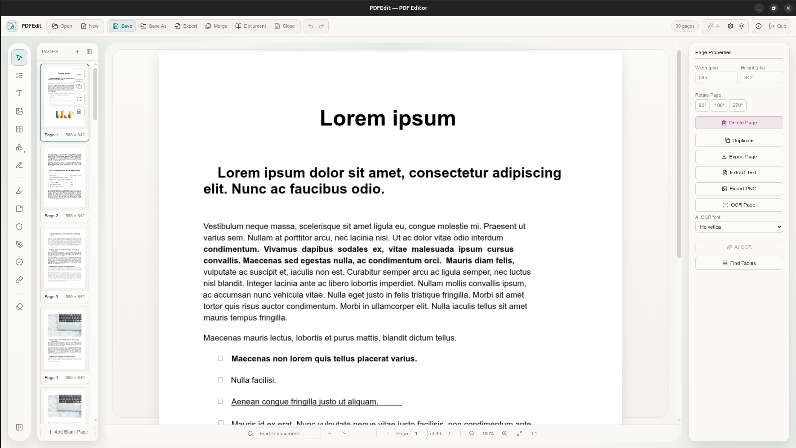
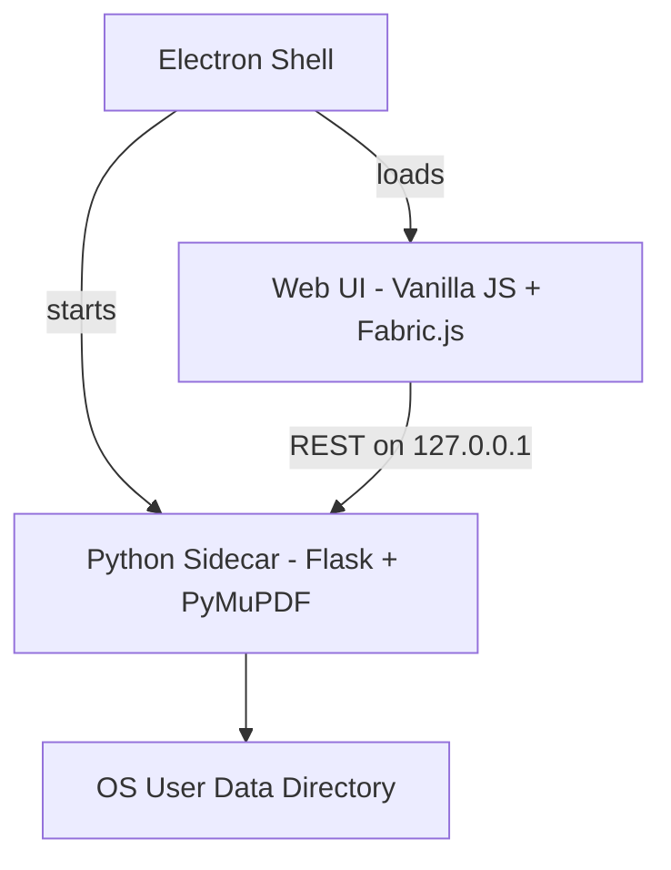

<p align="center">
  
</p>

<h1 align="center">PDFEdit Desktop</h1>

<p align="center">
  <strong>A cross-platform desktop PDF editor built with Electron, Flask, PyMuPDF, and Fabric.js.</strong>
</p>

<p align="center">
  
  
  
  
  
  
</p>

---

## Overview

**PDFEdit Desktop** packages the full [PDFEdit](https://github.com/ClaudiuJitea/PDFEdit) editor as a standalone application for **Windows, macOS, and Linux**. It combines an **Electron** shell with a local **Flask + PyMuPDF** sidecar, so you get the same rich editing experience as the web app without running a separate server or browser tab.

Open PDFs, annotate, fill forms, redact, sign, run OCR, detect tables, and export — all offline-capable once installed.

---

## Key Features

### Advanced Document Lifecycle
* **Drag-and-drop uploads** for PDFs up to 50MB, with password-protected document support.
* **Create blank PDFs** from presets (`A4`, `Letter`, `Legal`, `A3`, `A5`) or custom dimensions.
* **Save** overwrites the opened file; **Save As** chooses a new location via the native dialog.
* **Export** with flattening, page ranges, split-to-ZIP, and optional encryption passwords.
* **Session drafts** under your OS user-data directory for recovery after crashes or restarts.

### Precise Annotations & Visual Edits
* Move, scale, rotate, and delete PDF-origin elements; deletions become true redactions on save.
* Text boxes, images, shapes, freehand drawing, highlights, sticky notes, stamps, and redaction blocks.
* Signature and initials pad with draw, type, or upload modes.
* Per-page undo/redo (up to 50 steps).

### Smart Forms & Interactivity
* Fill and build AcroForm fields: text, checkbox, radio, combobox, and listbox.
* Hyperlink manager for external URLs and in-document page targets.

### Deep Page Operations
* Thumbnail navigation, drag-and-drop reorder, rotate, duplicate, add, and delete pages.
* Per-page PNG export, text extraction, OCR, and table detection.

### Intelligent OCR & Tables
* **Tesseract OCR** (bundled or linked at build time) for offline text extraction.
* Table detection with CSV export.

### Desktop Integration
* Native **Open**, **Save**, **Save As**, and **Export** dialogs.
* In-app **About** and **Quit** controls with themed modals.
* Loopback-only API with per-launch authentication token.
* Works fully offline (AI features still require network when enabled).

---

## Hotkeys & Keyboard Shortcuts

| Shortcut | Action |
|:---|:---|
| <kbd>Ctrl</kbd> + <kbd>O</kbd> / <kbd>Cmd</kbd> + <kbd>O</kbd> | Open PDF |
| <kbd>Ctrl</kbd> + <kbd>S</kbd> / <kbd>Cmd</kbd> + <kbd>S</kbd> | Save (overwrite opened file, or Save As if untitled) |
| <kbd>Ctrl</kbd> + <kbd>Shift</kbd> + <kbd>S</kbd> / <kbd>Cmd</kbd> + <kbd>Shift</kbd> + <kbd>S</kbd> | Save As |
| <kbd>Ctrl</kbd> + <kbd>W</kbd> / <kbd>Cmd</kbd> + <kbd>W</kbd> | Close document |
| <kbd>Ctrl</kbd> + <kbd>Z</kbd> / <kbd>Cmd</kbd> + <kbd>Z</kbd> | Undo |
| <kbd>Ctrl</kbd> + <kbd>Y</kbd> / <kbd>Cmd</kbd> + <kbd>Y</kbd> | Redo |
| <kbd>V</kbd> | Select tool |
| <kbd>O</kbd> | Form mode |
| <kbd>T</kbd> | Add text |
| <kbd>I</kbd> | Insert image |
| <kbd>Esc</kbd> | Cancel / exit active tool |

See the [web app README](https://github.com/ClaudiuJitea/PDFEdit#hotkeys--keyboard-shortcuts) for the full shortcut list.

---

## Architecture



| Component | Role |
|-----------|------|
| `desktop/` | Electron main process, preload bridge, sidecar lifecycle |
| `backend/` | Flask API, PDF engine, templates, and static UI |
| `build/` | PyInstaller sidecar + electron-builder packaging |
| `dist/` | Generated AppImage, `.deb`, and other installers |

---

## Project Structure

```
PDFEditApp/
├── backend/           # Flask + PyMuPDF sidecar
├── desktop/           # Electron shell
├── build/             # Packaging scripts and configs
├── scripts/           # Dev and sync helpers
├── tests/             # Backend and desktop tests
├── assets/            # App icons and legacy banner assets
├── images/            # README screenshots
├── vendor/            # Local dependency shims
├── package.json       # Electron dependencies
└── README.md
```

---

## Installation

### Option A: Download a release (recommended)

When releases are published, download the installer for your platform from [GitHub Releases](https://github.com/ClaudiuJitea/PDFEditApp/releases):

* **Linux:** `PDFEdit-*.AppImage` or `.deb`
* **Windows:** `.exe` installer
* **macOS:** `.dmg`

Make the AppImage executable and run it:

```bash
chmod +x PDFEdit-*.AppImage
./PDFEdit-*.AppImage
```

### Option B: Build from source

#### Prerequisites

* **Node.js 22.12+** and **npm**
* **Python 3.11+**
* **Linux build tools** for PyInstaller (e.g. `build-essential`)
* Optional: **Tesseract** and **OpenSSL** on PATH (or use `build/fetch-native-tools.sh` to link system binaries)

#### 1. Clone this repository

```bash
git clone https://github.com/ClaudiuJitea/PDFEditApp.git
cd PDFEditApp
```

#### 2. Install dependencies

```bash
npm install
python3 -m venv backend/.venv
backend/.venv/bin/python -m pip install --upgrade pip
backend/.venv/bin/pip install -r backend/requirements.txt
bash build/fetch-native-tools.sh
```

#### 3. Development mode

```bash
bash scripts/dev.sh
```

#### 4. Production build

```bash
npm run build
```

Artifacts are written to `dist/desktop/` (AppImage and `.deb` on Linux).

---

## App Icon

The packaged AppImage / installer icon matches the in-app toolbar brand mark (document + pencil).
Source: [`assets/icons/icon.png`](assets/icons/icon.png). The desktop build copies size variants into `build/icons/` for electron-builder.

```bash
# Refresh derived icons from assets/icons/icon.png
npm run build:icon

# Regenerate assets/icons/icon.png from the in-app brand mark
python3 build/generate-icon.py --brand
```

Use a different square PNG (ideally 1024×1024):

```bash
bash build/prepare-icon.sh /path/to/your-icon.png
npm run build:desktop
```

---

## Runtime Data

**Save** / **Save As** write PDFs to the location you choose. Temporary working copies, crash-recovery drafts, and AI settings are stored separately:

| OS | Working drafts / settings |
|----|---------------------------|
| Windows | `%APPDATA%/PDFEdit` |
| macOS | `~/Library/Application Support/PDFEdit` |
| Linux | `~/.local/share/pdfedit` |

On Linux, Electron’s own profile cache stays under `~/.config/PDFEdit` and is not used for document drafts.

---

## AI (OpenRouter)

Optional AI features use [OpenRouter](https://openrouter.ai/) when configured in **Settings**. API keys are stored locally in your user-data directory, not in the app bundle.

```bash
export OPENROUTER_API_KEY="sk-or-..."
export OPENROUTER_MODEL="openai/gpt-4o-mini"
```

AI requests send document text and/or page images to OpenRouter. Do not use with confidential documents unless your provider policy allows it.

---

## Syncing from the Web App

This desktop project is derived from [PDFEdit](https://github.com/ClaudiuJitea/PDFEdit). To copy upstream web changes:

```bash
bash scripts/sync-from-web.sh
```

Then re-apply desktop-specific customizations listed in the script output.

---

## Security

* The Python sidecar binds to **127.0.0.1** only.
* API requests require a per-launch `X-PDFEdit-Token` header.
* Electron runs with **context isolation** and a restricted preload bridge.
* No remote code is loaded; core UI assets are bundled for offline use.

---

## Technology Stack

* **Shell:** [Electron](https://www.electronjs.org/)
* **Backend:** [Python](https://www.python.org/), [Flask](https://flask.palletsprojects.com/), [Waitress](https://docs.pylonsproject.org/projects/waitress/)
* **PDF engine:** [PyMuPDF](https://pymupdf.readthedocs.io/)
* **Canvas UI:** [Fabric.js](https://fabricjs.com/)
* **Packaging:** [PyInstaller](https://pyinstaller.org/), [electron-builder](https://www.electron.build/)

---

## License

This project is licensed under the **MIT License** — see [LICENSE](LICENSE).

Third-party notices: [THIRD_PARTY_NOTICES.md](THIRD_PARTY_NOTICES.md).
